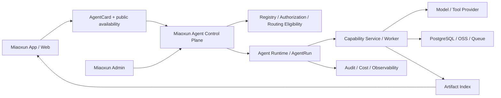

# 妙讯内部 Agent 创建、测试、接入与上架 SOP

---
document_id: MX-AGENT-SOP
version: 0.2.0
status: trial
scope: miaoxun-internal-agents
owners: miaoxun-agent-platform
last_updated: 2026-08-05
normative_language: RFC-2119-style
machine_contracts:
  index: sop-index.json
  manifest_schema: schemas/agent-manifest.schema.json
  agent_card_schema: schemas/agent-card.schema.json
  runtime_status_schema: schemas/runtime-status.schema.json
  agent_event_schema: schemas/agent-event.schema.json
  evaluation_suite_schema: schemas/evaluation-suite.schema.json
  quality_gates: quality-gates.json
  command_contract: command-contract.md
---

## 0. 如何使用本 SOP

本 SOP 用于妙讯团队内部创建、测试、接入、上架、运行、升级和下架所有类型的 Agent。它同时面向人类开发者和执行开发任务的 AI Agent。

规范词含义：

- **必须（MUST）**：缺失即阻塞进入下一阶段。
- **禁止（MUST NOT）**：出现即判定失败。
- **应当（SHOULD）**：默认执行；如不执行，必须在发布证据包中写明原因、风险和批准人。
- **可以（MAY）**：按 Agent 类型和复杂度选择。

执行本 SOP 的 AI Agent 必须遵守：

1. 先读取本文件、`quality-gates.json` 和 Manifest Schema，再修改代码。
2. 不推断缺失的业务、权限、费用或数据保留决策；缺失时停止在当前门禁。
3. 不因测试困难、供应商不可用或发布时间紧张而跳过阻塞门禁。
4. 不在代码、日志、测试输出、文档或命令参数中写入密码、Token、API Key 和 OSS 密钥。
5. 每次执行输出已完成门禁、失败门禁、证据路径、未解决风险和下一步。
6. 未经明确批准不得触发真实付费调用、生产发布、数据删除或公开发布。

文件导航：

- 人类和 Agent 的规范入口：本 `README.md`
- 机器导航和实现状态：`sop-index.json`
- Manifest 机器校验：`schemas/agent-manifest.schema.json`
- App/Admin 安全投影：`schemas/agent-card.schema.json`
- 路由与运行状态：`schemas/runtime-status.schema.json`
- 进度与审计事件：`schemas/agent-event.schema.json`
- 评测套件：`schemas/evaluation-suite.schema.json`
- 门禁和类型追加要求：`quality-gates.json`
- CLI 接口约定：`command-contract.md`
- 可直接填写的交付模板：`templates/`

注意：v0.2 已定义 CLI 契约和机器 Schema，但 CLI 代码尚未实现。任何执行者都不得把文档中的目标命令报告为当前已可运行能力。

本版本为 **v0.2 试行版**。它保留 v0.1 的强制安全、费用和发布门禁，并吸收 3D Agent 实践中可验证的模式。下一次完整的非 3D Agent 实践后必须复盘；试行期间不能以“文档尚未自动化”为由绕过阻塞门禁。

v0.2 相对 v0.1 的可审计增量：

- 增加从 Manifest 生成的 AgentCard，明确客户端只能消费安全投影。
- 将注册、生命周期、运维启用、liveness、readiness、容量和路由资格拆分为 RuntimeStatus。
- 为异步/事件型 Agent 增加 Checkpoint、单调事件、回放和去重约束。
- 将质量评测固定为版本化 EvaluationSuite，而非单次演示或 HTTP 成功。
- 固化最小 Admin 控制数据和审计要求，但不声称相应 UI 已完成。

## 1. 目标与适用范围

目标是让团队成员或开发 Agent 能够依据同一套规则完成：

```text
立项 -> 搭建 -> 开发 -> 测试 -> 妙讯接入 -> 上架 -> 发布 -> 运维 -> 下架
```

覆盖类型：

- 对话型 Agent
- 同步工具型 Agent
- 异步生成型 Agent
- 编排型 Agent
- 事件触发型 Agent
- 使用外部供应商的 Agent
- 产生持久化产物的 Agent
- 付费、敏感数据或高风险操作 Agent

本 SOP 当前不覆盖第三方开发者独立托管和外部 Agent 市场协议。所有 Agent 均由妙讯团队负责并通过妙讯后端统一接入。

## 2. 核心定义

### 2.1 Agent 不是 Prompt

一个可上架的妙讯 Agent 由五部分组成：

1. **Agent Identity**：名称、版本、图标、说明、类型和负责人。
2. **Interaction**：对话、工作台、确认步骤、状态和失败恢复。
3. **Capability**：模型、工具、业务服务、队列或 worker。
4. **Artifact**：消息、建议、草稿、图片、文件、3D 模型或发布版本。
5. **Control and Audit**：注册、授权、费用、配额、审计、监控、暂停和删除。

3D 经验中的“3D 形象顾问”是对话 Agent；照片上传、四视图、Tripo 建模和 GLB 保存是受控 Capability Workflow。两者可以绑定，但禁止把付费工作流伪装成一次普通对话调用。

### 2.2 标准对象

- **AgentManifest**：Agent 的版本化声明，是注册和检查的唯一事实来源。
- **AgentCard**：由控制面从 Manifest 生成的客户端安全投影；不是 Manifest 的原样副本。
- **RuntimeStatus**：控制面计算的生命周期、启用、liveness、readiness、容量和路由资格状态。
- **AgentRun**：一次用户或系统调用，是统一审计根对象。
- **CapabilityJob**：复杂业务的领域任务，必须关联一个 AgentRun。
- **AgentEvent**：AgentRun 的可重放、幂等、脱敏事件；用于进度、状态和审计。
- **Checkpoint**：可恢复任务在安全边界保存的最小状态，不能保存完整原始会话或密钥。
- **Artifact**：由 AgentRun 产生并由妙讯索引的持久化结果。
- **ProviderCall**：对模型、工具或外部服务的一次受控调用。
- **EvaluationSuite**：有版本、可复现、带质量阈值的测试样例和评分规则。
- **ReleaseEvidence**：证明某个 Git 提交可以发布的不可变证据包。

## 3. 架构边界



### 3.1 强制边界

- App、Web 和 Admin **必须**只调用妙讯后端。
- 客户端**禁止**保存供应商密钥、拼接系统 Prompt、选择底层供应商或直连数据库。
- 注册、鉴权、授权、readiness、费用、审计和 Artifact 索引**必须**由妙讯后端控制。
- 客户端只可读取后端生成的 AgentCard 和公共可用性投影，**禁止**读取完整 Manifest、RuntimeStatus 原始探针或 Provider 配置。
- `registered` 只表示注册表存在；它绝不等于可展示、可路由或可开始新任务。
- Capability 可以在 Node 服务、独立 worker 或内部服务运行，但必须服从同一 AgentRun 和审计协议。
- Prompt、Provider 和存储实现可以替换；对客户端公开的契约必须保持版本兼容或按 major 版本迁移。
- 当前范围仍是妙讯内部 Agent。**禁止**把第三方或用户提供的 Agent 源码、Prompt 包或二进制直接在主进程执行。未来若扩展第三方托管，必须先提供独立进程/容器或 WASM 隔离、签名包、最小权限、网络/文件策略和独立安全审查。

### 3.2 代码边界

每个 Agent 分为：

```text
Agent Package
  identity / manifest / plan / policy / readiness declaration

Capability Package
  route / schema / service / repository / provider / worker / artifact / tests
```

简单对话 Agent 可以只有 Agent Package。凡是写数据库、调用工具、产生费用、异步运行或产生持久化产物的 Agent，必须具有 Capability Package。

现有 `agents/*.agent.js` 在 v0.2 保持兼容。新工具应生成规范 Manifest、AgentCard、RuntimeStatus/Event fixture 和评测骨架，并由适配层投影到现有 registry；在完成一次试行前，不强制一次性重构全部旧 Agent。

## 4. 类型配置档

Agent 可同时命中多个配置档。Manifest 必须声明全部适用项。

| 配置档 | 判定条件 | 追加门禁 |
| --- | --- | --- |
| `conversational` | 通过消息回答或建议 | Prompt 评测、上下文和越权测试 |
| `synchronous-tool` | 请求内完成工具操作 | 超时、幂等和副作用测试 |
| `asynchronous-generation` | 创建可恢复长任务 | 状态机、检查点、领取、恢复、取消、单调进度和事件重放测试 |
| `orchestrator` | 调用一个或多个子 Agent | 子权限、循环上限、补偿和调用树审计 |
| `event-driven` | 无当前用户请求也可触发 | 去重、乱序、重放、检查点、暂停和死信处理 |
| `external-provider` | 调用第三方模型或工具 | 错误映射、超时、数据出境和供应商校准 |
| `artifact-producing` | 保存可再次访问的产物 | 所有权、格式、查看、保留和删除测试 |
| `paid` | 调用可能产生费用 | 预算、确认、计费状态、熔断和退款策略 |
| `sensitive-data` | 处理照片、位置、文件等 | 最小化、同意、保留、删除和脱敏审计 |
| `high-risk-action` | 发布、外发、删除或不可逆操作 | 二次确认、人工审核或管理授权 |

## 5. 风险分级

| 等级 | 描述 | 最低要求 |
| --- | --- | --- |
| R0 | 只读、无外部调用的建议或查询 | 标准鉴权、输入校验、审计 |
| R1 | 写入私有草稿或低成本模型调用 | 幂等、恢复、配额、用户可撤销 |
| R2 | 敏感数据、付费调用或持久化产物 | 明示同意、费用确认、删除、质量和安全审核 |
| R3 | 公开发布、外部发送、持续自动执行、高费用或不可逆操作 | 二次确认，并要求人工审核或管理端授权 |

风险等级由数据、权限、费用和副作用中的最高等级决定。禁止为了减少流程而下调风险等级。

## 6. 生命周期与阶段门禁

### S0 立项

输入：明确的用户问题和业务目标。

必须完成：

- 使用 `templates/01-proposal.md` 定义目标用户、任务、非目标、成功指标和负责人。
- 证明该能力需要 Agent，而不是普通表单、搜索、规则或静态功能。
- 确认是否存在外部供应商、费用、敏感数据和持久化产物。

输出：批准的 Agent Proposal。

阻塞条件：目标不可衡量、负责人缺失、供应商或合规前提不清楚。

### S1 类型与风险分级

必须完成：

- 选择全部类型配置档。
- 使用 `templates/02-risk-assessment.md` 判定 R0-R3。
- 声明数据分类、权限、用户确认和人工审核要求。

输出：风险判定记录。

阻塞条件：敏感数据、费用或不可逆操作没有控制方案。

### S2 契约设计

必须完成：

- 创建符合 `schemas/agent-manifest.schema.json` 的 Manifest。
- 定义 Manifest 到 `AgentCard` 的安全投影，并用 `schemas/agent-card.schema.json` 校验。
- 定义 `RuntimeStatus` 与路由资格，不得将注册状态当作可用状态。
- 定义公共 AgentRun 状态、领域状态和合法转换。
- 定义输入、输出、错误、事件、Artifact 和 EvaluationSuite Schema。
- 定义 API 幂等、超时、取消、恢复和兼容策略。
- 异步或事件型 Agent 必须定义 Checkpoint schema、恢复边界、事件顺序、订阅幂等和回放窗口。
- 使用 `templates/03-api-artifact-contract.md` 固化契约。

输出：版本化契约。

阻塞条件：客户端需要理解供应商细节，或业务任务无法关联 AgentRun。

### S3 标准脚手架

目标命令：

```bash
npm run agent:new -- --key <agent-key> --profiles <profile,...>
```

必须生成 Agent Package、Manifest、AgentCard/RuntimeStatus/Event/Evaluation fixture、测试入口、必要的 Capability 骨架和本地证据目录。禁止手工复制另一个 Agent 后仅修改名称。

### S4 本地实现

必须遵守：

- Schema 先于业务逻辑。
- Service 负责编排，Repository 负责持久化，Provider Adapter 负责外部协议。
- Provider 原始响应不得直接成为 App DTO。
- 所有副作用必须幂等或有明确补偿。
- 异步任务必须可恢复，不依赖单一进程内存状态。
- Checkpoint 只保存恢复所需的最小化、脱敏状态；恢复前必须校验 Agent key、版本、Schema 和兼容策略。未通过校验时只能从安全边界重启或转人工处理。
- Event 事件必须在同一 `runId + attempt` 内维护单调 `sequence`；消费者使用 `deliveryKey` 去重，不能把重复投递当作重复业务执行。
- Provider、worker 和控制面必须传播同一 `traceId`；不允许用完整原始输入替代结构化审计。
- Artifact 必须先完成私有持久化和所有权绑定，再对用户可见。

### S5 自动验证

必须通过 G0-G5，且每个 Agent 必须执行版本化 EvaluationSuite。适用类型必须加载对应追加测试。命令和退出码见 `command-contract.md`。

### S6 妙讯沙箱接入

必须使用真实妙讯测试账号完成：

- 获取 Agent 列表和授权。
- 验证 AgentCard、public availability、路由资格和 App 版本不兼容时的安全文案。
- 创建、读取、确认、取消和恢复 AgentRun。
- 验证断线后按 `afterSequence` 回放事件、重复事件幂等、乱序重同步和 Checkpoint 恢复。
- 验证失败、超时、会话过期和跨用户访问。
- 查看、下载或删除 Artifact。
- 确认 App 不显示环境变量、Provider 原始错误和内部存储信息。

沙箱测试禁止产生未批准的真实费用。

### S7 真实供应商校准

仅适用于 external-provider 或 paid：

- 使用 `templates/06-calibration-record.md`。
- 由授权人明确批准预算、调用次数和是否允许重试。
- 默认最多一次调用，失败不自动重试。
- 保存受控输入摘要、Provider/模型版本、耗时、费用、质量和计费结果。
- 校准产物不得自动公开。

### S8 上架审查

必须审查：产品说明、AgentCard、入口、权限、费用、数据用途、失败体验、Artifact 展示、AI 标识、支持和下架方式；以及 Admin 中的可用性、最近运行、指标、费用、评测版本和 kill switch 是否可操作。

### S9 预发布与生产发布

- 只允许由同一 Git SHA 构建的不可变制品部署。
- 数据库迁移必须有账本并通过全量重放。
- 发布证据必须由 `agent:release` 生成并经 Release Owner 审批。
- 生产部署后执行只读 readiness 和受控 smoke。
- 禁止在服务器手工覆盖部分源码、测试或静态资源。

### S10 运行、升级与下架

- 监控成功率、延迟、费用、队列、Artifact 错误、安全事件、事件回放失败、Checkpoint 恢复失败和评测漂移。
- patch/minor/major 变更按第 16 节处理。
- 暂停 Provider 调用不得删除历史 Artifact。
- 下架必须停止新调用、保留合法读取期、执行数据清理并记录证据。

## 7. Manifest 规范

Manifest 的机器规范见 `schemas/agent-manifest.schema.json`。最低内容包括：

- 身份、语义版本、负责人和生命周期状态
- 类型配置档、入口和执行模式
- 能力、权限、输入输出契约
- Artifact 声明
- 风险和数据分类
- 用户确认与人工审核规则
- 费用、配额、全局预算和重试规则
- Provider、环境能力和 readiness
- 审计事件、trace propagation 和 Checkpoint 兼容策略
- 面向用户的目录说明、能力摘要和交互语义
- 版本化 EvaluationSuite、最低分数和人工质量判断要求
- App、控制面和 Artifact 兼容版本
- 暂停、弃用、下架和 Admin 控制策略

Manifest 是注册事实来源。客户端展示数据由后端安全投影产生，不直接读取源 Manifest。

### 7.1 AgentCard、RuntimeStatus 与路由资格

`AgentCard` 是 App/Web/Admin 用于上架展示和交互选择的安全 DTO，机器规范为 `schemas/agent-card.schema.json`。它只包含名称、能力、适用/不适用情形、交互方式、Artifact 查看器、最低 App 版本和经过脱敏的可用性；不得包含 Provider 名称、环境变量、内部 endpoint、数据库对象、原始错误或任何密钥。

`RuntimeStatus` 是控制面的状态记录，机器规范为 `schemas/runtime-status.schema.json`。它必须把下列概念分开：

- `lifecycle`：发布治理状态，来自 Manifest。
- `operatorEnabled`：运维是否允许新任务。
- `liveness`：服务是否活着。
- `readiness`：当前是否满足开始工作的依赖条件。
- `capacity`：当前是否仍可承接新任务。
- `routeEligibility`：注册、生命周期、启用、就绪和容量的组合结果。

控制面的最低路由规则为：

```text
canRouteNewRun =
  registered
  AND lifecycle in {limited_release, available}
  AND operatorEnabled
  AND readiness == ready
  AND capacity == available, or capacity == limited with an explicit admission policy
```

随后还必须叠加当前用户授权、配额、风险确认和最低 App build。任何一个条件不满足，控制面不得创建 AgentRun。客户端只获得产品化 `publicAvailability` 和稳定 reason code，例如 `not-ready` 或 `app-version-too-old`；它不得获知缺失的供应商配置名称。

### 7.2 评测与原型诚实性

每个 Agent 都必须有 `EvaluationSuite`，机器规范为 `schemas/evaluation-suite.schema.json`。评测套件包含版本化 fixture 引用、成功/失败/边界/恢复/越权等案例、预期状态与 Artifact、成本和时延上限、自动断言、人工质量 rubric 与及格阈值。不能用“接口返回 200”或单次人工演示替代评测。

`draft`、`review`、`sandbox` 只代表设计、审核或沙箱状态，必须在 AgentCard/后台中如实标记，不能被描述为已上线能力。只有 `limited_release` 或 `available` 才可进入用户可用路由。

## 8. 统一调用协议

标准控制面：

```text
GET    /api/agents
GET    /api/agents/:agentKey
GET    /api/admin/agents/:agentKey/runtime-status
POST   /api/agent-runs
GET    /api/agent-runs/:runId
POST   /api/agent-runs/:runId/confirm
POST   /api/agent-runs/:runId/cancel
GET    /api/agent-runs/:runId/events?attempt=:attempt&afterSequence=:sequence
GET    /api/agent-runs/:runId/artifacts
```

复杂业务可以有专用 API，例如 `/api/avatar-3d/*`，但其 CapabilityJob 必须关联 `agentRunId`。

`GET /api/agents` 和 bootstrap 返回 AgentCard 的安全投影及 public availability，不返回源 Manifest。RuntimeStatus 只向有相应后台权限的控制面读取；即使如此也不得返回密钥、环境变量值、签名 URL 或 Provider 原始错误。

### 8.1 公共状态

```text
accepted
awaiting_input
awaiting_confirmation
queued
running
awaiting_user
succeeded
failed
cancelled
```

领域过程使用 `detailStatus`，但只能返回产品化枚举和值。`succeeded` 和 `failed` 为终态；终态禁止回到运行态。重试必须创建新的 attempt，保留原 attempt 的计费和错误记录。

### 8.2 事件、进度与恢复

事件必须符合 `schemas/agent-event.schema.json`。最少覆盖：

```text
agent.run.accepted
agent.run.queued
agent.run.progress
agent.run.awaiting-confirmation
agent.run.awaiting-user
agent.run.succeeded
agent.run.failed
agent.run.cancelled
```

事件由 `runId + attempt + sequence` 排序；同一范围内 sequence 必须递增且不能重用。客户端以 `deliveryKey` 去重，断线后以最后确认的 sequence 请求回放。事件至少保留到当前任务可恢复或可解释的时间窗口；重放失败进入受控死信/人工处理，不允许静默丢失。进度只展示产品阶段、百分比、可取消性和安全文本，禁止展示模型思维链、Provider 原文或敏感输入。

### 8.3 创建请求

所有创建请求必须包含或由服务生成：

- 登录用户及 Agent 授权
- `Idempotency-Key`
- 输入 Schema 版本
- 权限和数据归属结果
- Agent、Capability 和契约版本快照
- `requestId` 和 `runId`
- 贯穿控制面、worker 与 Provider Adapter 的 `traceId`
- 高风险或费用确认版本

### 8.4 错误

公开错误只包含稳定 `code`、产品文案、`requestId`、是否可重试和建议动作。原始 Provider 响应、堆栈、数据库信息和密钥只允许进入受限运维日志，并仍需脱敏。

## 9. 权限、安全与隐私

- 权限必须最小化，并使用明确 scope；禁止使用无边界的 `admin` 或 `all` 权限代替设计。
- 每个资源读取、修改、下载和删除都必须在后端验证当前用户所有权。
- 文件必须校验大小、MIME、magic bytes、解码结果和恶意内容；不能信任扩展名。
- Prompt 上下文只传递完成任务必需的数据，不包含密码、Token、OSS key、私有 URL 或无关历史。
- 模型输出必须经过 Schema 和业务规则验证，禁止直接执行模型生成的 SQL、HTML、脚本或系统命令。
- R2/R3 必须定义内容审核、人工处理和申诉路径。
- 敏感数据必须声明收集目的、Provider 去向、保留期限和删除流程。
- 账号删除必须覆盖数据库、OSS、队列、Artifact 和可删除的第三方资产。

威胁模型使用 `templates/04-threat-model.md`。

## 10. 费用与重试

付费 Agent 必须同时具有：

- Provider 调用总开关，默认关闭。
- 用户配额。
- 全局预算和告警阈值。
- 执行前预计费用。
- 明确的扣费时点。
- `charged`、`uncharged`、`refunded`、`unknown` 计费状态。
- 预算熔断和人工恢复流程。

禁止行为：

- `unknown` 计费状态自动重试。
- 因客户端超时而直接重复提交 Provider 任务。
- 仅靠 allowlist 控制总费用。
- 在 Provider 调用开启时把全体用户开放作为无审查配置修改。

技术重试和质量重试必须分开。每次重试创建不可变 attempt，并保留来源、原因、Provider task ID、质量结果和计费结果。

费用记录必须关联 `runId`、`attempt`、`traceId`、Provider/模型版本、预计与实际金额、币种、计费处置和账单证据引用。不得把原始请求、密钥或签名 URL 写入费用记录。

## 11. Artifact 规范

Artifact 最低字段：

- `artifactId`、`userId`、`agentRunId`
- Agent 和 Capability 版本
- 类型、标题、受控摘要和缩略图
- MIME、字节数、格式版本
- 内容摘要（推荐 SHA-256）和校验结果
- 私有、可分享、已发布或已撤销状态
- 创建、过期、删除时间
- AI 来源标识和 Provider 版本
- 查看器类型及最低 App 版本

要求：

- OSS 默认私有，访问使用短期签名 URL 或后端流式鉴权。
- App 不能使用原始存储键。
- 大型产物必须有移动端优化版本；缺失时明确失败，禁止静默下载不可用原件。
- 删除必须幂等，并在存储清理成功后更新数据库状态。
- 下载、预览和发布前必须核验 Artifact 内容摘要；校验失败时不得提供可能损坏或被替换的文件。
- 分享必须可撤销；公开发布必须创建不可变 release。

## 12. 审计与可观测性

每个 AgentRun 至少记录：

- 请求、用户、Agent、Capability 和版本
- 输入类型及脱敏摘要
- 权限、确认和触发来源
- 每次状态变化、耗时、重试和取消
- `traceId`、`attempt`、事件 `sequence`、`deliveryKey` 和事件回放/死信结果
- Provider 和私有任务标识
- Provider/模型版本、预计费用、实际费用、币种和计费结果
- Artifact ID、保留和删除状态
- 安全审核、质量审核、EvaluationSuite 版本/得分和最终结果

必须提供：

- 结构化日志和贯穿链路的 `requestId/runId/traceId`
- 成功率、P50/P95 延迟、失败码、队列深度和费用指标
- readiness 与 liveness 分离
- AgentCard 投影校验、路由拒绝原因、事件重放和 Checkpoint 恢复指标
- 告警接收人和故障 Runbook
- 日志访问权限或集中式错误平台

禁止记录密码、Bearer Token、Cookie、API Key、原始照片/文件正文和未脱敏 Provider 响应。

## 13. 测试门禁

门禁的机器定义见 `quality-gates.json`。

| 门禁 | 内容 | 是否阻塞 |
| --- | --- | --- |
| G0 | Manifest、AgentCard、RuntimeStatus、事件和静态规范 | 是 |
| G1 | 单元测试 | 是 |
| G2 | API/Event/Artifact/状态投影契约 | 是 |
| G3 | 安全、隐私、费用 | 是 |
| G4 | 数据库、队列、OSS、Provider Mock、Checkpoint/回放集成 | 是 |
| G5 | 妙讯沙箱 E2E、目录和路由资格 | 是 |
| G6 | 真实供应商校准 | 对适用 Agent 阻塞 |
| G7 | 发布、迁移、监控和回滚 | 是 |

测试必须覆盖成功、失败、超时、取消、重复请求、恢复、越权、删除和旧版本兼容。只测试 happy path 判定为失败。

EvaluationSuite 必须使用非生产个人数据或已获独立测试授权的合成 fixture。结果必须记录 suite 版本、fixture 版本、实际模型/Provider 版本、分数、失败案例、耗时和费用。对于图像、3D、视频等质量不宜只用字符串断言的产物，必须同时有可审计的自动指标和人工 rubric。

有 UI 或 Artifact 查看器时，必须覆盖目标桌面和移动视口；3D、视频、Canvas 等还必须验证非空像素、实际渲染、资源加载和内存释放。

## 14. 妙讯上架与客户端接入

生命周期状态：

```text
draft -> review -> sandbox -> limited_release -> available
                                      \-> suspended -> deprecated -> removed
```

`registered` 只表示后端知道该 Agent，不表示用户可用。上架还必须满足：

- 审核状态允许展示。
- readiness 正常。
- 用户已获授权。
- App 版本兼容。
- 付费和风险控制已开启。

上架客户端只能以 AgentCard 渲染名称、能力、限制、入口和安全可用性。创建任务前，控制面必须再次计算用户授权、App build、风险确认、配额、预算和路由资格；不得信任客户端缓存的可用状态。

上架资料必须说明：能做什么、不能做什么、入口、权限、数据用途、第三方模型、费用、配额、Artifact 和保留期。

交互规则：

- 对话型进入 Agent 会话。
- 同步工具型使用轻量操作界面。
- 异步型使用可恢复任务工作台。
- 编排型展示总体步骤，不展示内部思维链。
- 事件型提供订阅、暂停和执行历史。
- 费用或高风险操作在真正执行点二次确认。

App 必须通过 bootstrap 或增量同步获得 AgentCard、上架、授权和 public availability 投影，禁止硬编码可用状态。用户看到“暂不可用”时只能展示稳定的产品文案和 reason code 所对应的帮助内容，不展示 `*_API_KEY`、环境名、Provider 错误或内部 endpoint。

Admin 的最低能力不是一套单独的 Agent 应用，而是控制面的受控视图。每个上架 Agent 必须可查看：

- AgentCard 与当前生命周期。
- 启用状态、liveness、readiness、容量、路由拒绝原因和最近状态变化。
- 当前/最近 AgentRun、P50/P95、成功率、稳定错误码、队列和 Artifact 错误。
- 预计/实际费用、计费处置、预算与熔断状态。
- EvaluationSuite/Calibration 版本、最新得分和已知限制。
- 新任务与 Provider kill switch，以及谁在何时操作过它们。

上述能力可分阶段建设后台 UI，但相应数据契约、审计和权限必须随 Agent 上架同时存在。

## 15. 发布、部署与回滚

ReleaseEvidence 必须包含：

- Git SHA、分支和 Manifest 摘要
- 依赖锁文件摘要和构建环境
- G0-G7 结果及证据路径
- 数据库迁移账本与重放结果
- 真实校准记录
- EvaluationSuite 报告、AgentCard 投影快照和 RuntimeStatus 摘要
- 安全与隐私审批
- App/Web 兼容矩阵
- 环境 readiness
- 部署、监控和回滚命令

部署必须由 CI 制品或可验证的发布包完成。线上源码、测试、迁移和静态资源必须来自同一 Git SHA。服务启动后必须验证 `/api/health`、`/api/ready`、Agent readiness 和不产生费用的 smoke。

回滚前必须判断数据库迁移是否向后兼容。禁止通过删除生产表或 `git reset --hard` 处理普通发布失败。

## 16. 版本、暂停与下架

- **patch**：不改变公开契约的修复。
- **minor**：向后兼容地增加能力。
- **major**：输入、输出、权限、费用、Artifact 或行为契约发生不兼容变化。

关键 Prompt、模型、Provider、质量阈值、Checkpoint schema、EvaluationSuite 和费用规则必须版本化，禁止静默替换。

紧急暂停顺序：

1. 关闭新的 Provider 调用。
2. 停止创建新 AgentRun。
3. 保留历史读取和用户数据导出/删除能力。
4. 记录事故、影响范围和费用状态。
5. 修复后从 limited release 恢复，不直接全量开放。

## 17. 角色与审批

- **Agent Owner**：目标、边界和版本。
- **Capability Owner**：服务、Provider、状态机和 Artifact。
- **Client Owner**：App/Web 体验和兼容性。
- **Security Reviewer**：权限、隐私、费用和滥用风险。
- **Release Owner**：制品、迁移、部署、监控和回滚。

同一个人可以兼任多个角色，但 R2/R3 不得完全自审自发。审批人及时间必须写入发布证据。

## 18. 标准命令

完整约定见 `command-contract.md`。目标命令：

```bash
npm run agent:new -- --key <key> --profiles <profiles>
npm run agent:check -- --agent <key>
npm run agent:test -- --agent <key>
npm run agent:eval -- --agent <key> --suite default
npm run agent:smoke -- --agent <key> --environment sandbox
npm run agent:release -- --agent <key> --environment staging
```

所有命令必须支持 `--format json`，以便开发 Agent 和 CI 读取。`agent:new` 必须同时生成投影、事件、评测和按 profile 需要的 Checkpoint 骨架；`agent:check` 必须校验 Manifest 到 AgentCard 的字段投影以及禁止字段泄漏；`agent:release` 只生成证据包，不直接部署。

## 19. Definition of Done

一个 Agent 仅在以下全部满足时可以标记为完成：

- Manifest 通过 Schema。
- Manifest 到 AgentCard 的投影通过 Schema，且不存在 Provider、密钥、环境、内部 endpoint 或原始错误字段泄漏。
- Owner、类型、风险、权限和非目标明确。
- 所有业务任务关联 AgentRun。
- 输入、输出、错误、事件、Artifact、RuntimeStatus 和 EvaluationSuite 契约版本化。
- 异步/事件型任务具备校验过的 Checkpoint、可恢复状态、单调事件序列和回放/去重行为。
- G0-G7 中所有适用门禁通过。
- 版本化 EvaluationSuite 达到及格阈值；需要人工质量判断的结果有 rubric 和结论。
- 真实费用、失败计费和重试策略已验证。
- App/Web 能展示、恢复和删除真实结果。
- 审计、监控、告警和 Runbook 可用。
- 发布可以对应唯一 Git SHA 并完成回滚。
- 上架资料、支持方式和下架策略已批准。

“接口存在”“返回不是 404”“Mock 测试成功”“曾经人工跑通过一次”均不等于完成。

## 20. v0.2 试行与复盘

选择一个新的非 3D Agent，从 S0 到 S10 完整实践。记录：

- 每个阶段实际耗时。
- 无法自动执行的步骤。
- 重复填写的信息。
- 不合理或缺失的门禁。
- 人类和开发 Agent 对同一条规则的不同理解。
- 被迫进行的例外及其风险。
- Manifest/AgentCard/RuntimeStatus 是否发生信息漂移。
- 事件回放、Checkpoint 恢复和 EvaluationSuite 是否可由人类和开发 Agent 独立执行。

使用 `templates/09-retrospective.md` 复盘。安全、权限、费用、数据归属、审计和发布一致性门禁在试行期间仍不可豁免。

## 21. 文件索引

- `sop-index.json`：机器导航、实现状态和执行约束。
- `schemas/agent-manifest.schema.json`：Manifest 机器校验规范。
- `schemas/agent-card.schema.json`：客户端安全 AgentCard 规范。
- `schemas/runtime-status.schema.json`：控制面运行状态和路由资格规范。
- `schemas/agent-event.schema.json`：可重放、脱敏事件规范。
- `schemas/evaluation-suite.schema.json`：版本化评测套件规范。
- `templates/agent-manifest.example.json`：复杂功能型 Agent 的完整示例。
- `templates/agent-card.example.json`、`runtime-status.example.json`、`agent-event.example.json`、`evaluation-suite.example.json`：机器契约样例。
- `quality-gates.json`：门禁与类型追加要求。
- `command-contract.md`：统一命令、输出和退出码。
- `templates/01-proposal.md`：立项卡。
- `templates/02-risk-assessment.md`：类型和风险判定。
- `templates/03-api-artifact-contract.md`：调用和产物契约。
- `templates/04-threat-model.md`：威胁模型。
- `templates/05-test-matrix.md`：测试矩阵。
- `templates/06-calibration-record.md`：真实供应商校准。
- `templates/07-release-evidence.md`：发布证据包。
- `templates/08-runbook.md`：运维手册。
- `templates/09-retrospective.md`：试行复盘。
- `templates/10-checkpoint-and-progress.md`：恢复和进度契约。
- `templates/11-evaluation-suite.md`：评测套件。
- `templates/12-agent-card-and-catalog.md`：AgentCard、目录、路由和后台控制清单。
