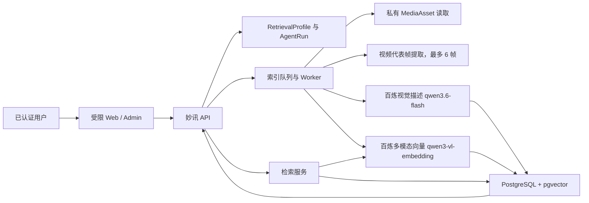

# 媒体检索 Agent 设计

**状态：** 已确认设计，待实施计划评审

**日期：** 2026-08-06

**试点范围：** 妙讯后端与受限 Web/Admin 环境

**对应 SOP：** Agent SOP v0.2，风险等级 R2

## 1. 目标

构建一个独立的“媒体检索 Agent”。它只检索用户已经上传到妙讯私有媒体库的图片和视频，不生成任何新图片、视频或人物内容。

用户可用自然语言寻找自己的素材，例如“穿黄裙子的女性照片”“海边日落的视频”“有会议标题的截图”。系统对图片和视频代表帧生成受控描述、OCR 文本和多模态向量索引，再在用户自己的私有范围内召回和排序结果。

本试点同时验证 Agent SOP v0.2 是否足以指导一个含异步任务、外部付费模型、私有数据和跨端产物的 Agent 从设计走到受限发布。

## 2. 已确认决策

| 领域 | 决策 |
| --- | --- |
| 素材范围 | 仅检索已上传到妙讯的私有图片和视频；不读取手机相册或其他第三方素材库。 |
| 开启方式 | 用户必须明确同意一次，才会对已有素材补建索引，并对后续上传素材增量索引。用户可停用并删除索引。 |
| 身份边界 | 不做脸部识别、名人识别、人物身份推断或人脸聚类。姓名只能匹配既有标题、标签、说明或 OCR 文本。 |
| 视频范围 | 只抽取最多 6 张代表帧进行视觉和 OCR 描述；不做音频转写。 |
| 模型供应商 | 仅使用阿里云百炼，避免多供应商成本、合规和运维复杂度。 |
| 描述模型 | 使用 `qwen3.6-flash` 的 JSON Object 模式输出视觉描述；后端以 JSON Schema 验证和白名单过滤约束持久化字段。 |
| 向量模型 | 使用 `qwen3-vl-embedding` 的 1024 维共享多模态向量空间，为文本查询和图片/视频帧建立向量。 |
| 向量存储 | PostgreSQL 的 `pgvector` 扩展；首版不引入单独向量数据库。 |
| 检索方式 | 向量语义召回 + 已有 caption/tag/OCR 字段过滤 + 本地排序。首版不调用重排模型。 |
| 成本控制 | 外部付费调用默认关闭，需用户授权；设置每用户额度、全局预算和告警。未知计费结果不得自动重试。 |
| 首发渠道 | 先在后端与受限 Web/Admin 中验证。质量和安全门槛通过后，才规划 TestFlight/App 接入。 |

## 3. 非目标

- 不生成图像、视频、3D 模型或人物形象。
- 不承诺从模糊、低分辨率或不存在的画面中恢复事实。
- 不把视觉模型的描述当作人物身份、敏感属性或事实鉴定。
- 不公开原始文件 URL、对象存储路径、向量、模型密钥、供应商原始响应或内部错误详情。
- 不替换现有 `album-manager` 的素材整理和关键词能力。该 Agent 保持原有职责；媒体检索能力由新 Agent 独立提供。
- 不在首版搜索时重新分析原媒体。一次查询最多发起一次文本向量调用。

## 4. 与现有系统的关系

现有 `station_media_assets` 是私有素材主记录，已有用户归属、素材类型、存储键、caption、tags、metadata 和受保护的文件访问路径。本 Agent 以它为唯一原始素材来源。

现有 `/api/station/media-assets/search` 保留为文件名、caption 和 tags 的词法搜索。新 Agent 提供独立的语义检索端点，不能改变旧端点的兼容行为。

现有 `generation_jobs` 面向生成型任务，不承载本 Agent 的索引工作。现有 `agent_runs` 只保存传统聊天调用的最终 `success` 或 `error` 记录，不能单独承担标准化的异步生命周期。实施时需要在不破坏旧聊天记录的前提下扩展通用运行控制面，并为本 Agent 建立专用索引作业记录。

## 5. 领域模型

| 名称 | 定义 |
| --- | --- |
| MediaAsset | 用户上传的原始图片或视频，来自 `station_media_assets`。 |
| RetrievalProfile | 用户对检索索引的授权、启停状态、版本、额度和当前回填状态。 |
| AgentRun | 一次可审计的用户动作或系统触发运行，如开启回填、增量索引、重建、删除索引或搜索。 |
| IndexJob | 一个可恢复的异步索引单元，处理一个素材或一个回填分页。 |
| Segment | 可检索内容单元。图片对应一个素材段；视频对应最多 6 个带时间点的关键帧段。 |
| Descriptor | 受 JSON Schema 约束的非身份化视觉描述，包括服饰、颜色、场景、动作、物体和 OCR 文本。 |
| Embedding | 1024 维向量，仅在数据库私有表中保存和计算，不下发客户端。 |
| SearchHit | 对用户返回的受控检索命中，指向已有 `MediaAsset` 和可能的关键帧时间点。 |
| ContentFingerprint | 基于素材版本、大小、存储对象版本和处理配置形成的指纹，用于幂等、失效和恢复。 |

## 6. 架构



所有供应商调用均由后端 Worker 发起。Worker 从受保护存储读取原始字节或短生命周期的内部代理流，不把公开对象存储地址交给客户端，也不将存储地址写入运行事件。

## 7. 数据设计与迁移

实施阶段创建以下数据库对象，并把迁移作为可回滚、可验证的独立步骤。

### 7.1 `agent_runs` 的兼容扩展

保留现有 `status` 字段和旧值语义，避免影响已有聊天记录和消费者。新增以下字段：

| 字段 | 说明 |
| --- | --- |
| `run_type` | `chat`、`media-index`、`media-search`；旧记录默认 `chat`。 |
| `lifecycle_status` | `accepted`、`queued`、`running`、`awaiting_user`、`succeeded`、`failed`、`cancelled`、`blocked`。旧记录根据原状态回填为 `succeeded` 或 `failed`。 |
| `trace_id` | 服务端生成的可关联追踪标识。 |
| `attempt` | 从 1 开始的运行尝试次数。 |
| `input_summary` | 脱敏后的输入摘要，禁止保存原始媒体字节和密钥。 |
| `confirmation` | 记录用户授权或确认的版本、时间和来源。 |
| `failure_code` | 稳定、面向产品的失败码，而非供应商原始错误。 |

新增异步记录在既有 `status` 中使用兼容值 `pending`，只在终态写入既有的 `success` 或 `error`。所有新功能和管理界面优先读取 `lifecycle_status`；旧聊天运行继续维持原有 `success/error` 行为。

新增通用 `agent_run_events` 表：`agent_run_id`、`sequence`、`event_type`、`stage`、`progress_percent`、`payload`、`delivery_key`、`trace_id`、`occurred_at`。其中 `(agent_run_id, sequence)` 与 `delivery_key` 唯一，事件 payload 通过白名单序列化，禁止含密钥、原始 URL、媒体字节、完整供应商响应和用户隐私正文。

### 7.2 `media_retrieval_profiles`

每名用户仅有一条记录：

- `user_id` 主键，外键到用户。
- `enabled`、`consent_version`、`consented_at`、`disabled_at`。
- `backfill_run_id`、`backfill_state`、`last_indexed_at`。
- `index_version` 和 `descriptor_schema_version`。
- `daily_request_limit`、`daily_request_used`、`monthly_cost_limit_cents`、`monthly_cost_used_cents`。
- `created_at`、`updated_at`。

只有 `enabled = true` 且确认版本与当前服务端版本一致时，才允许产生新的索引供应商调用。

### 7.3 `media_retrieval_jobs`

每个异步作业关联一个 `agent_run_id` 和一个私有 `user_id`。字段包括：

- `job_type`：`backfill-page`、`asset-index`、`reindex`、`purge`。
- `media_asset_id`：素材级作业必填，分页回填可以为空。
- `status`：与标准生命周期一致。
- `attempt`、`checkpoint`、`content_fingerprint`、`processing_version`。
- `provider_model`、`provider_request_ref`、`cost_cents`，均只保存可审计元数据，不保存密钥或原始供应商负载。
- `last_error_code`、`created_at`、`started_at`、`finished_at`。

每个作业以 `(user_id, media_asset_id, content_fingerprint, processing_version)` 保证同一素材版本不会被并发重复索引。重新索引创建新作业，不覆盖可追溯的旧运行记录。

### 7.4 `media_retrieval_segments`

每个可检索段必须带有 `user_id`，使授权范围成为查询的强制条件。字段包括：

- `id`、`user_id`、`media_asset_id`、`kind`（`image` 或 `video-frame`）。
- `frame_timestamp_ms`，图片为 `NULL`，视频帧为非负整数。
- `content_fingerprint`、`descriptor_schema_version`、`embedding_model_version`、`index_version`。
- `caption`、`ocr_text`、`labels`、`descriptor`，均为受控字段而非供应商原文。
- `embedding vector(1024)`。
- `state`（`ready`、`superseded`、`purged`）、`created_at`、`purged_at`。

迁移启用 `vector` 扩展，建立 `user_id`、`media_asset_id` 和活跃段过滤索引，以及活跃向量段的 HNSW 余弦索引。每一个查询 SQL 都必须显式包含 `user_id = authenticated_user_id` 与 `state = 'ready'`，不得依靠客户端筛选。

软删除素材、停用索引和账户删除均须触发段失效或级联清除。一个已删除、已禁用或不再归属当前用户的素材不得出现在检索结果中，即使旧向量仍在物理清理队列中。

## 8. 索引流程

### 8.1 开启与回填

1. 用户在受限 Web/Admin 中阅读用途、数据范围、供应商处理说明和删除方式，提交当前 `consentVersion`。
2. `POST /api/station/media-retrieval/enable` 创建一个 `media-index` 类型 `AgentRun`，状态为 `accepted`，并原子更新 `RetrievalProfile`。
3. 回填枚举该用户状态为 `uploaded` 的私有媒体，不读取其他用户素材。
4. 每页和每个素材均创建可恢复 `IndexJob`，通过 checkpoint 保存继续位置和输入指纹。
5. 成功索引的素材更新为 ready；不可处理的素材记录稳定原因码，不影响原素材可见性。
6. 父运行在全部子作业完成、跳过或清理后进入最终状态，并保存聚合数量和成本。

### 8.2 图片处理

1. 校验所属用户、上传状态、内容类型、大小和输入指纹。
2. 从受保护存储取得图片，做解码安全检查和尺寸限制。
3. 调用 `qwen3.6-flash` 的 JSON Object 模式，随后在后端验证既定 JSON Schema。
4. 对图片调用 `qwen3-vl-embedding`，生成 1024 维向量。
5. 在同一事务中写入受控 Descriptor、向量和状态；若输入指纹变化，旧段置为 `superseded`。

### 8.3 视频处理

1. 校验视频格式、时长、大小和所属用户。
2. Worker 在隔离处理环境抽取最多 6 张有代表性的帧，不解析或转写音频。
3. 每张帧独立生成视觉/OCR 描述和图像向量。
4. 为每个成功帧写入一个 `video-frame` 段和时间点；素材层状态记录成功、部分成功或跳过。
5. 任一帧失败不会以虚构描述补全。达到帧数或预算上限后停止后续处理。

### 8.4 增量、变更与删除

- 新素材上传完成后，若用户已启用索引，创建单素材 `asset-index` 作业。
- 原文件、存储对象版本、媒体类型或处理版本变化时，指纹变化并创建新版本段。
- caption 或 tags 更新会立即参与词法过滤和排序；不因纯文本编辑而重新发送视觉描述调用。
- 原素材软删除时，相关段必须在同一业务流程中先不可召回，再异步物理清除。
- 用户停用或删除索引时，立即关闭新任务入队、撤销所有段的可查询状态，并运行可审计 `purge` 作业清除 Descriptor 和向量。

## 9. 模型输出契约

视觉描述只允许保存下列字段。模型只负责生成 JSON Object；解析、Schema 验证、字段长度限制、未知字段删除和最终持久化均由服务端执行。无效 JSON 或验证失败视为契约违规，不把原始响应写入数据库，也不触发未知计费重试。

```json
{
  "summary": "不超过 160 个字符的画面描述",
  "clothing": [{"type": "dress", "color": "yellow"}],
  "scene": ["outdoor", "beach"],
  "actions": ["standing"],
  "objects": ["umbrella"],
  "ocrText": ["可辨认的可见文字"],
  "qualitySignals": ["blurred", "low-light"]
}
```

禁止字段包括姓名、名人、身份、年龄、性别、种族、健康、情绪诊断、政治或宗教观点，以及任何脸部特征向量或人脸标识。模型返回的未知字段必须被丢弃并记录为契约违规，不得直接持久化。

向量模型使用 1024 维。所有写入前验证维度、有限数值和模型版本。查询时只产生一个文本向量，禁止因单次搜索重新读取或重新分析媒体。

## 10. 检索和排序

`POST /api/station/media-retrieval/search` 接受：

```json
{
  "query": "穿着黄裙子的女性照片",
  "limit": 20,
  "kind": "image",
  "albumId": "可选的用户自有相册 ID"
}
```

处理顺序：

1. 验证登录、启用状态、额度和请求参数。
2. 创建 `media-search` 类型 `AgentRun`，记录脱敏查询摘要和追踪 ID。
3. 对查询调用一次仅处理文本的 `qwen3.6-flash` JSON Object 解析，生成 `visualQuery`、`identityTerms` 和 `parseConfidence`。姓名、昵称、名人、角色和其他可识别人物指称只能作为既有 caption、tags 或 OCR 的精确文本约束，绝不进入语义向量文本。
4. 对余下的非身份化视觉描述调用一次 `qwen3-vl-embedding` 的文本模式；若查询只包含身份词，则只执行精确文本匹配，不调用语义向量。
5. 在当前用户、活跃段、可见素材范围内进行向量召回。
6. 使用 caption、tags、OCR 和请求过滤条件做本地加权排序和去重，同一素材优先保留最匹配的段。
7. 返回最多 20 个结果。没有命中时返回空数组和正常的“未找到匹配素材”状态，不制造结果。

结果对象只包括：`mediaAssetId`、`kind`、`matchedFrameTimestampMs`、受控 `summary`、`matchReasons`、`scoreBucket`。客户端通过既有受保护媒体读取接口加载缩略图或原文件。结果不包含向量、对象存储位置、供应商字段、原始置信度或其他用户的信息。

身份词隔离组件只处理用户的查询文本，不读取媒体，也不做任何人物识别。它必须采用失败封闭行为：JSON 无效、字段缺失或 `parseConfidence` 不足时，只执行精确文字匹配，不发送语义向量请求，并记录脱敏的策略命中结果。该组件的正反例纳入 30 条评测和安全测试。

首版性能门槛是：已完成索引后的搜索 P95 不高于 2 秒。性能测量包含一次文本查询解析、至多一次文本向量请求、数据库召回和本地排序，但不包含媒体再次分析。

## 11. 对外 API

| 方法和路径 | 行为 | 成功响应 |
| --- | --- | --- |
| `POST /api/station/media-retrieval/enable` | 验证同意版本，开启索引并创建回填运行。 | `202`，返回安全 Profile 摘要与 `agentRunId`。 |
| `GET /api/station/media-retrieval/status` | 返回当前用户的启用、回填、数量、额度和最近运行摘要。 | `200`。 |
| `POST /api/station/media-retrieval/search` | 对已索引私有素材执行一次文本语义检索。 | `200`，返回 SearchHit 数组与 `agentRunId`。 |
| `POST /api/station/media-retrieval/reindex` | 明确请求重建 `stale` 或 `all` 范围的索引。 | `202`，返回 `agentRunId`。 |
| `DELETE /api/station/media-retrieval/index` | 停用并创建可审计清除任务。 | `202`，返回 `agentRunId`。 |
| `GET /api/agent-runs/:runId/events` | 返回当前用户有权限查看的脱敏生命周期事件。 | `200`。 |

所有写操作接受幂等键。权限检查在服务端基于已认证用户重新执行，不能信任客户端传入的用户 ID、asset ID 归属、缓存 Profile 或状态。

产品错误码为稳定分类，例如 `retrieval_not_enabled`、`retrieval_budget_exhausted`、`retrieval_service_unavailable`、`asset_not_indexable` 和 `run_not_found`。不得把密钥名、供应商 HTTP 响应、数据库名称、表名或对象存储路径返回给普通用户。

## 12. 生命周期、事件与恢复

所有业务任务遵守：

`accepted -> queued -> running -> awaiting_user | succeeded | failed | cancelled | blocked`

索引阶段使用：`enumerating`、`reading-asset`、`extracting-frames`、`describing`、`embedding`、`committing`、`purging`。每个阶段写有序事件、进度和脱敏摘要。

安全的技术性失败可基于相同 `content_fingerprint`、幂等键和明确成本结果重试。供应商超时、未知计费、可能已扣费但未返回结果、授权撤回和预算耗尽均不自动重试。恢复时从 `checkpoint` 和已经持久化的段状态继续，不能重复写入或重复收费。

## 13. 安全、隐私和成本控制

- 一切媒体读取、段写入、搜索和事件读取均以 `user_id` 为强制边界。
- API 日志只记录追踪 ID、状态、数量、耗时、稳定错误码和聚合成本；不记录搜索原文、媒体 URL、媒体字节、密钥或原始模型响应。
- 模型密钥只通过服务端环境配置注入。就绪状态仅显示“已配置”“未配置”“不可用”等安全摘要。
- 模型适配层必须验证响应 JSON、尺寸、内容类型、向量维度和成本元数据。
- Worker 处理媒体时执行文件大小、解码像素、视频时长、帧数和执行超时限制，防止压缩炸弹和资源耗尽。
- 每用户每日请求上限、每用户月度成本上限、系统月度预算和告警均在供应商调用前检查，并在调用后记账。
- 管理员可通过开关停止新索引、停止搜索供应商调用、停止队列消费和停止单个用户的索引；已完成的私有索引不会因关闭供应商而失去读取权限，除非用户本人停用或删除索引。
- 所有正额度初始为 `0`，Provider 调用保持关闭。只有发布 Owner 在受限环境配置了正的用户额度和系统预算，且用户已明确批准一次真实付费校准后，才可触发真实供应商调用。
- Descriptor 和向量只在原素材仍可见且用户保持启用时保存；停用或删除索引后立即不可查询，并在清除作业成功后物理删除。运行与事件的脱敏审计记录保留 180 天，聚合成本记录保留 24 个月；期限届满后按平台数据清理任务删除或不可逆聚合。
- 搜索 Provider 开关关闭时，语义搜索返回 `retrieval_service_unavailable`，不悄悄改为模糊匹配或将其他用户结果当作替代结果。已有索引只可在不需新 Provider 调用的管理核验路径中读取。

## 14. Web/Admin 试点体验

首发不进入 App。受限 Web/Admin 需要提供：

- Agent Card：用途、私有范围、启用状态、模型可用性和受控健康摘要。
- 用户面板：同意开启、回填进度、自然语言搜索、命中预览、停用和删除索引。
- 运行视图：AgentRun 生命周期、阶段、进度、失败码和脱敏事件。
- 管理视图：总索引数、队列积压、成功率、成本、预算、最近运行、就绪状态和停机开关。
- 空结果、处理中、部分完成、预算受限、服务暂不可用和已删除索引等完整状态。

任何页面不得显示供应商密钥、对象存储地址、数据库结构、内部端点、原始错误正文或其他用户的素材计数。

## 15. 验收与自动化测试

评测素材必须是合成素材或获得明确授权的测试素材。评测集包含 30 个自然语言查询，覆盖颜色、服饰、场景、动作、物体、OCR、图片、视频代表帧、无结果和删除后查询。

上线门槛：

- Top-5 人工相关性不低于 85%。
- 两个隔离测试账号的跨用户泄漏为 0。
- 已删除素材和已停用索引的素材不可被召回，Descriptor 和向量无残留。
- 已完成索引的查询 P95 不高于 2 秒。
- 每张图片最多一次视觉描述调用和一次向量调用；每个视频最多 6 帧。
- 搜索每次仅一次文本向量调用，绝不重新分析素材。
- 身份词、名人和人物姓名只能命中该用户已有 caption、tags 或 OCR；它们不能作为向量检索条件，也不能通过视觉结果被推断。
- 真实付费校准记录模型版本、实际成本、请求数、结果、人工质量判断、失败和计费结论；未知计费不自动重试。

自动化测试至少包括：

| 层级 | 必测内容 |
| --- | --- |
| 单元 | consent 校验、输入指纹、Descriptor Schema 过滤、向量维度、排序、预算、重试决策、事件脱敏。 |
| 合约 | 六个 API 的成功、认证、参数错误、稳定错误码和响应字段禁止项。 |
| 数据库 | pgvector 迁移、用户过滤、软删除失效、清除级联、唯一约束和旧 `agent_runs` 兼容回填。 |
| 集成 | 模型适配器 mock、图片/视频帧索引、断点恢复、幂等重放、队列故障恢复、一次查询调用次数。 |
| 安全 | 两个用户互相猜测 asset ID、run ID、album ID 和事件 ID 均不能越权读取；日志与响应扫描不得出现密钥或私有 URL。 |
| 端到端 | Web/Admin 开启、回填、搜索、无结果、停用、删除、恢复展示和停机开关。 |

## 16. SOP v0.2 试点映射

| 阶段 | 本 Agent 的证据 | 进入下一阶段的条件 |
| --- | --- | --- |
| S0 | 本设计的目标、非目标、成功指标和发布边界。 | 指派必需责任角色。 |
| S1 | R2 风险登记：私有媒体、外部付费模型、异步处理和供应商依赖。 | 风险控制可验证。 |
| S2 | Manifest、Card、RuntimeStatus、Event、Checkpoint、Evaluation 合同。 | `agent:check` 与 schema 校验通过。 |
| S3 | 独立 Agent scaffold、迁移、Provider adapter、受限路由。 | 单元和合约测试通过。 |
| S4 | 私有索引、队列、恢复、清除、运行事件。 | 集成和安全测试通过。 |
| S5 | 受限 Web/Admin、可观测性、预算和停机开关。 | 管理验收通过。 |
| S6 | 两账号隔离试验、30 查询评测、删除验证。 | 全部质量门槛通过。 |
| S7 | 用户明确批准后的一次真实付费校准。 | 成本和质量证据完成。 |
| S8 | 有限 Web/Admin 灰度，不接入 App。 | 运行稳定且无安全事件。 |
| S9 | 复盘指标、问题和改进建议。 | 发布责任人确认。 |
| S10 | 只有在上述证据齐全后才评估 App/TestFlight 接入。 | 独立客户端发布决策。 |

S0 在进入 S3 前必须记录以下责任角色的明确负责人：Agent Owner、能力 Owner、客户端 Owner、安全审查人和发布 Owner。本设计不推断人员归属。

## 17. 实施前的明确前提

1. PostgreSQL 实例支持安装并验证 `pgvector` 扩展；若不支持，S3 阶段停止，不以应用层数组比较替代。
2. 服务器配置有阿里云百炼的最小权限密钥，并在受限环境进行一次显式批准的付费校准前保持 Provider 调用关闭。
3. 存储层允许 Worker 以受保护方式读取用户自己的已上传媒体，且不需要公开 URL。
4. 队列 Worker、预算记账和管理停机开关在真实供应商调用前可用并有自动化测试。
5. 本文中的 API、状态、数据字段和验收门槛是实施基线；任何偏离需要形成新的决策记录并更新评测。

## 18. 当前结论

该 Agent 可以作为 SOP v0.2 的首个端到端试点：它有清晰产品边界、私有数据边界、可计量的质量目标、异步运行模型、成本治理和受限发布路径。下一步是对本设计进行审阅并编写逐文件、逐测试的实施计划；在计划获批前不创建实现代码、不调用付费模型、不部署服务，也不合并至 App。
